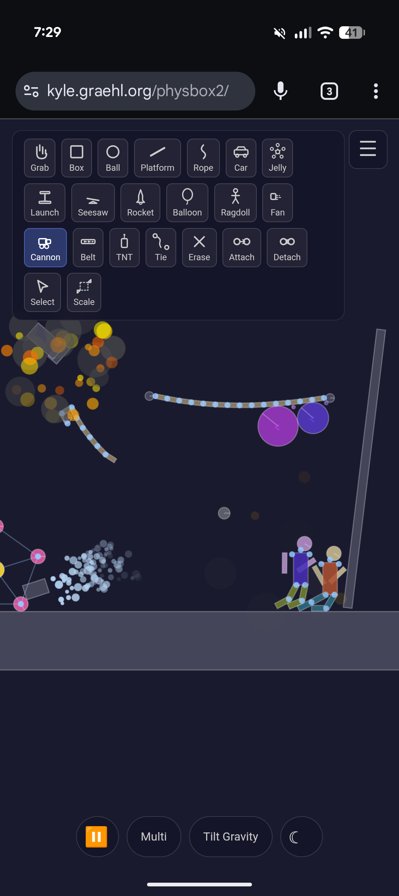

# PhysBox 2

2D physics sandbox built with Planck.js (Box2D), TypeScript, and Canvas 2D.

**[Play it live](https://kyle.graehl.org/physbox2/)**

## Tools

Grab, Box, Ball, Platform, Rope, Car, Jelly, Launch, Seesaw, Rocket, Balloon, Ragdoll, Fan, Cannon, Belt, TNT, Tie, Erase, Attach, Detach, Select, Scale

## Features

- Touch-first: works on phones and tablets with tap, drag, pinch-zoom
- Tilt gravity on mobile via device accelerometer
- Light/dark mode toggle
- Pause, multi-select, and settings panel
